# Railclaw — Multi-Agent Architecture

## System Overview

Mermaid source

## Three-Agent Model

Mermaid source

## Business Onboarding Flow

Mermaid source

## Payment Command Flow (via Orchestrator)

Mermaid source

## Boundary Rejection Flow (via Orchestrator)

```mermaid
sequenceDiagram
    actor User as Business User
    participant Product as Agent: business-product
    participant Orch as Agent: orchestrator

    User->>Product: Create payment link<br/>for 100 USDC on Solana

    Product->>Product: Parse: chain=solana
    Product->>Orch: sessions_send:<br/>{ action: create_payment_link, chain: solana }

    Orch->>Orch: Read BOUNDARY.md<br/>allowed_chains: [polygon]
    Orch->>Orch: solana ∉ [polygon]<br/>DECISION: INVALID

    Orch->>Orch: Write memory trace

    Orch-->>Product: { status: rejected,<br/>violation: chain,<br/>policy: [polygon], received: solana }

    Product->>User: REJECTED<br/>Violation: chain<br/>Policy: [polygon]<br/>Received: solana
```

Mermaid source

## Boundary Change = Immediate Effect

Mermaid source

## Workspace Layout

Mermaid source

